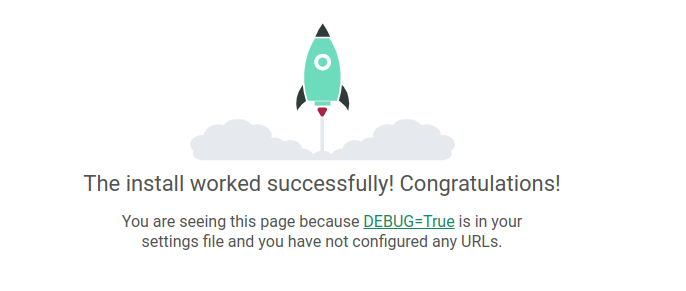

# Simple Django project with docker, docker-compose and CI/CD using mikr.us  
## Intro
This repository was created for the speech at the [PyStok](https://pystok.org/pystok-55/) [#55](https://www.facebook.com/events/486108750034527) event. 
This guide will demonstrate how to use Docker, Docker-Compose, and Gitlab CI to make your small project Dockerize and deploy to [mikr.us](https://mikr.us/) VPS.

## Requirements
Before start make sure that you have installed:
- [Docker](https://docs.docker.com/desktop/) ([Linux](https://docs.docker.com/desktop/install/linux-install/), [Mac](https://docs.docker.com/desktop/install/mac-install/), [Windows](https://docs.docker.com/desktop/install/windows-install/))
- [Docker Compose v2](https://docs.docker.com/compose/install/) - You need this only if you have installed Docker Engine or Docker CLI. Docker Desktop includes Docker Compose.

## Creating a project from scratch
#### For a better understanding, I encourage you to read:
 - [Docker tutorial](https://docs.docker.com/get-started/)
 - [Docker Compose tutorial](https://docs.docker.com/compose/gettingstarted/)
   - [Explore the full list of Compose commands](https://docs.docker.com/compose/reference/)
   - [Explore the Compose configuration file reference](https://docs.docker.com/compose/compose-file/)
 - [Django tutorial](https://docs.djangoproject.com/en/3.2/intro/tutorial01/)

### Let's start with our project!

1. Create an empty project directory.
    
    ```console
    mkdir django-poll
    ```

    You can name the directory something easy for you to remember. This directory is the context for your application image. The directory should only contain resources to build that image.

2. Create a new file called `Dockerfile` in your project directory.

    The Dockerfile defines an application's image content via one or more build
    commands that configure that image. Once built, you can run the image in a
    container. For more information on `Dockerfile`, see the [Docker user guide](https://docs.docker.com/get-started/)
    and the [Dockerfile reference](https://docs.docker.com/engine/reference/builder/).

3. Add the following content to the `Dockerfile`.

    ```dockerfile
    # syntax=docker/dockerfile:1
    FROM python:3
    ENV PYTHONDONTWRITEBYTECODE=1
    ENV PYTHONUNBUFFERED=1
    WORKDIR /code
    COPY requirements.txt /code/
    RUN pip install -r requirements.txt
    COPY . /code/
    ```

    This `Dockerfile` starts with a [Python parent image](https://hub.docker.com/r/library/python).
    The parent image is modified by:
    - settings environment variables:
      - `ENV PYTHONDONTWRITEBYTECODE=1` - [This prevents Python from writing out pyc files](https://docs.python.org/3/using/cmdline.html#envvar-PYTHONDONTWRITEBYTECODE)
      - `ENV PYTHONUNBUFFERED=1` - [This keeps Python from buffering stdin/stdout](https://docs.python.org/3/using/cmdline.html#envvar-PYTHONUNBUFFERED)
      - `WORKDIR /code` - adding a new `code` directory
      - `COPY requirements.txt /code/` - coping `requirements.txt` file from [context](https://docs.docker.com/build/building/context/#path-context) to `code` folder inside docker image
      - `RUN pip install -r requirements.txt` - installing the Python requirements defined in the `requirements.txt` file

4. Create a `requirements.txt` in your project directory.

    This file is used by the `RUN pip install -r requirements.txt` command in your `Dockerfile`.

5. Add the required software in the file.

    ```python
    # Install last Django LTS
    Django>=3.2,<3.3
    # Install postgresql database adapter
    psycopg2>=2.9
    ```
   
6. Create a file called `docker-compose.yml` in your project directory.

    The `docker-compose.yml` file describes the services that make your app. In
    this example those services are a web server and database.  The compose file
    also describes which Docker images these services use, how they link
    together, any volumes they might need to be mounted inside the containers.
    Finally, the `docker-compose.yml` file describes which ports these services
    expose. See the [`docker-compose.yml` reference](https://docs.docker.com/compose/compose-file/) for more
    information on how this file works.

7. Add the following configuration to the file.

    ```yaml
    services:
      db:
        image: postgres
        volumes:
        - postgresql_data:/var/lib/postgresql/data
        environment:
        - POSTGRES_PASSWORD=${POSTGRES_PASSWORD:-postgres}
      web:
        build: .
        command: python manage.py runserver 0.0.0.0:8000
        volumes:
        - .:/code
        ports:
        - "8000:8000"
        environment:
        - POSTGRES_PASSWORD=${POSTGRES_PASSWORD:-postgres}
        depends_on:
        - db
    
    volumes:
      postgresql_data:
    ```

    This file defines two services: The `db` service and the `web` service.\
    `db` service will mount `postgresql_data` [volume](https://docs.docker.com/storage/volumes/) to 
    `/var/lib/postgresql/data` inside docker. Thanks to this, data from the container won't be lost. We also set new
    environment variable: `POSTGRES_PASSWORD` with password to postgres database. `${POSTGRES_PASSWORD:-postgres}` means
    take environment variable `POSTGRES_PASSWORD` or if it doesn't exist set default value to `postgres`.


### Create a Django project

In this step, you create a Django starter project by building the image from the build context defined in the previous procedure.

1. Go to the root of your project directory.
    ```console
    cd django-poll
    ```

2. Create the Django project by running the [docker compose run](https://docs.docker.com/engine/reference/commandline/compose_run/)
   command as follows. Project name should follow [PEP-8](https://peps.python.org/pep-0008/#package-and-module-names) naming convention.

   ```console
   docker compose run web django-admin startproject django_poll .
   ```

   This instructs Compose to run `django-admin startproject <project_name>`
   in a container, using the `web` service's image and configuration. Because
   the `web` image doesn't exist yet, Compose builds it from the current
   directory, as specified by the `build: .` line in `docker-compose.yml`.

   Once the `web` service image is built, Compose runs it and executes the
   `django-admin startproject` command in the container. This command
   instructs Django to create a set of files and directories representing a
   Django project.

3. After the `docker compose` command completes, list the contents of your project.

   ```console
   $ ls -l

    drwxr-xr-x 2 root    root    django_poll
    -rw-rw-r-- 1 user    user    docker-compose.yml
    -rw-rw-r-- 1 user    user    Dockerfile
    -rwxr-xr-x 1 root    root    manage.py
    -rw-rw-r-- 1 user    user    requirements.txt

   ```

   If you are running Docker on Linux, the files `django-admin` created are
   owned by root. This happens because the container runs as the root user.
   Change the ownership of the new files.

   ```console
   sudo chown -R $USER:$USER django_poll manage.py
   ```

   If you are running Docker on Mac or Windows, you should already
   have ownership of all files, including those generated by
   `django-admin`. List the files just to verify this.

### Connect the database and start project

In this section, you set up the database connection for Django and start docker compose with project.

1. In your project directory, edit the `django_poll/settings.py` file.

2. Replace the `DATABASES = ...` with the following:

    ```python
    # settings.py
    
    import os
    
    # ...
    
    DATABASES = {
       'default': {
           'ENGINE': 'django.db.backends.postgresql',
           'NAME': 'postgres',
           'USER': 'postgres',
           'PASSWORD': os.getenv('POSTGRES_PASSWORD'),
           'HOST': 'db',
           'PORT': 5432,
       }
    }
    
    # ...
    ```

    These settings are required because we decide to use [postgres](https://hub.docker.com/_/postgres)
    as database. We specified it in `docker-compose.yml`.

3. Run the [docker compose up](https://docs.docker.com/engine/reference/commandline/compose_up/) command from the top level directory for your project.

   ```console
   $ docker compose up
   
   [+] Running 2/0
    ⠿ Container django-poll-db-1   Running                                                                                                                                                                                                                                                                             0.0s
    ⠿ Container django-poll-web-1  Created                                                                                                                                                                                                                                                                             0.1s
   Attaching to django-poll-db-1, django-poll-web-1
    ⠿ Container django-poll-db-1            Created                                                                                                                                                                                                                                                                    0.1s
    ⠿ Container django-poll-web-1           Created                                                                                                                                                                                                                                                                    0.1s
   Attaching to django-poll-db-1, django-poll-web-1
   django-poll-db-1   | The files belonging to this database system will be owned by user "postgres".
   django-poll-db-1   | This user must also own the server process.
   < ... >
   django-poll-web-1  | Watching for file changes with StatReloader
   django-poll-web-1  | Performing system checks...
   django-poll-web-1  | 
   django-poll-web-1  | System check identified no issues (0 silenced).
   django-poll-web-1  | December 11, 2022 - 17:15:11
   django-poll-web-1  | Django version 3.2.16, using settings 'django_poll.settings'
   django-poll-web-1  | Starting development server at http://0.0.0.0:8000/
   django-poll-web-1  | Quit the server with CONTROL-C.
   
   ```

   At this point, your Django app should be running at port `8000` on
   your Docker host. On Docker Desktop for Mac and Docker Desktop for Windows, go
   to `http://localhost:8000` on a web browser to see the Django
   welcome page.
   

   > Note:
   >
   > On certain platforms (Windows 10), you might need to edit `ALLOWED_HOSTS`
   > inside `settings.py` and add your Docker host name or IP address to the list.
   > For demo purposes, you can set the value to:
   >
   > ```python
   > ALLOWED_HOSTS = ['*']
   > ```
   >
   > This value is **not** safe for production usage.  Refer to the
   > [Django documentation](https://docs.djangoproject.com/en/1.11/ref/settings/#allowed-hosts)  for more information.

4. List running containers.

   In another terminal window, list the running Docker processes with the `docker ps` or `docker container ls` command.

   ```console
   $ docker ps

   CONTAINER ID   IMAGE             COMMAND                  CREATED         STATUS         PORTS                                       NAMES
   42a04442ac98   django-poll-web   "python manage.py ru…"   3 minutes ago   Up 3 minutes   0.0.0.0:8000->8000/tcp, :::8000->8000/tcp   django-poll-web-1
   2068de7d75d8   postgres          "docker-entrypoint.s…"   3 minutes ago   Up 3 minutes   5432/tcp                                    django-poll-db-1
   ```

5. Shut down services and clean up by using either of these methods:

    * Stop the application by typing `Ctrl-C`  in the same shell in where you
      started it:

      ```console
      Gracefully stopping... (press Ctrl+C again to force)
      Killing django-poll-web-1 ... done
      Killing django-poll-db-1 ... done
      ```

    * Or, for a more elegant shutdown, switch to a different shell, and run
      [docker compose down](https://docs.docker.com/engine/reference/commandline/compose_down/) from the top level of your
      Django sample project directory.

      ```console
      $ docker compose down

      Stopping django-poll-web-1 ... done
      Stopping django-poll-db-1 ... done
      Removing django-poll-web-1 ... done
      Removing django-poll-web_run_1 ... done
      Removing django-poll-db-1 ... done
      Removing network django-poll_default
      ```

### Setup project for local development

In this section, you prepare project to easy local development.

1. Create a file called `docker-compose.override.yml` in your project directory and add following configuration.
    More about multiple Compose files you can read [here](https://docs.docker.com/compose/extends/#multiple-compose-files)
2. Add the following configuration to the file.
    ```yaml
    services:
      web:
        command: python manage.py runserver 0.0.0.0:8000
        volumes:
          - .:/code
    ```
    
    This file overrides `web` service by adding custom command `runserver` and mounting
    current directory to `/code` location inside container. Thanks to this operation, you will
    be able to work with the code inside the container that will be reloaded automatically.
3. Edit a `requirements.txt` in your project directory and add following packages.
   ```python
    # Install Python WSGI HTTP Server for UNIX
    gunicorn>=20.1
    # Install simplified static file serving for Python web apps
    whitenoise>=6.2
    ```
4. Edit a `web` section in `docker-compose.yml` it should look like below:
    ```yaml
     web:
       image: ${CI_REGISTRY_IMAGE:-local/django_poll}:${CI_COMMIT_REF_SLUG:-local}
       build: .
       command: bash -c "
         python manage.py migrate --noinput &&
         python manage.py collectstatic --noinput &&
         gunicorn django_poll.wsgi --workers 2 --bind 0.0.0.0:8000
         "
       ports:
       - "8000:8000"
       environment:
       - POSTGRES_PASSWORD=${POSTGRES_PASSWORD:-postgres}
       depends_on:
       - db
    ```
    We have added image name with default values which help us when we will be calling it in CI/CD.
    We use there [Gitlab Ci Variables](https://docs.gitlab.com/ee/ci/variables/) which are available in pipelines.
    We also add custom entrypoint command which we will use in the production environment. 
    Command will make Django migrations, collect static files which will be served by `whitenoise` and
    run gunicorn wsgi server with our app.
5. Edit `settings.py` file in your application:
    - Add to `MIDDLEWARE` list `"whitenoise.middleware.WhiteNoiseMiddleware",` at the end. 
    - Add `STATIC_ROOT = '/static/'` as config of root folder contains static files.
6. Edit `urls.py` file in your application by adding
    - at the beginning: 
    ```python
      from django.conf import settings
      from django.conf.urls.static import static
    ```
    - at the bottom: `urlpatterns += static(settings.MEDIA_URL, document_root=settings.MEDIA_ROOT)`
7. Now you are ready to rebuild project. This is needed for new dependencies declared in 
    the `requirements.txt` file to be installed. Just run
    ```console
    $ docker compose build
    [+] Building 1.6s (14/14) FINISHED                                                                                                                                                                                                                                                                                             
    => [internal] load build definition from Dockerfile                                                                                                                                                                                                                                                                      0.0s
    => => transferring dockerfile: 32B                                                                                                                                                                                                                                                                                       0.0s
    => [internal] load .dockerignore                                                                                                                                                                                                                                                                                         0.0s
    => => transferring context: 2B                                                                                                                                                                                                                                                                                           0.0s
    => resolve image config for docker.io/docker/dockerfile:1                                                                                                                                                                                                                                                                1.0s
    => CACHED docker-image://docker.io/docker/dockerfile:1@sha256:9ba7531bd80fb0a858632727cf7a112fbfd19b17e94c4e84ced81e24ef1a0dbc                                                                                                                                                                                           0.0s
    => [internal] load build definition from Dockerfile                                                                                                                                                                                                                                                                      0.0s
    => [internal] load .dockerignore                                                                                                                                                                                                                                                                                         0.0s
    => [internal] load metadata for docker.io/library/python:3                                                                                                                                                                                                                                                               0.0s
    => [1/5] FROM docker.io/library/python:3                                                                                                                                                                                                                                                                                 0.0s
    => [internal] load build context                                                                                                                                                                                                                                                                                         0.0s
    => => transferring context: 7.11kB                                                                                                                                                                                                                                                                                       0.0s
    => CACHED [2/5] WORKDIR /code                                                                                                                                                                                                                                                                                            0.0s
    => CACHED [3/5] COPY requirements.txt /code/                                                                                                                                                                                                                                                                             0.0s
    => CACHED [4/5] RUN pip install -r requirements.txt                                                                                                                                                                                                                                                                      0.0s
    => [5/5] COPY . /code/                                                                                                                                                                                                                                                                                                   0.0s
    => exporting to image                                                                                                                                                                                                                                                                                                    0.1s
    => => exporting layers                                                                                                                                                                                                                                                                                                   0.0s
    => => writing image sha256:770f3446a8da8cd89b454e5f6ea66368ec6fbcb16ab8b2b916f10b96389122e3                                                                                                                                                                                                                              0.0s
    => => naming to docker.io/local/django_poll:local
    ```
8. Now you can run the project once more, just run the [docker compose up](https://docs.docker.com/engine/reference/commandline/compose_up/) command from the top level directory for your project.

    ```console
    $ docker compose up
    [+] Running 2/2
    ⠿ Container django-poll-db-1   Created                                                                                                                                                                                                                                                                                   0.0s
    ⠿ Container django-poll-web-1  Recreated                                                                                                                                                                                                                                                                                 0.1s
    Attaching to django-poll-db-1, django-poll-web-1
    django-poll-db-1   | 
    django-poll-db-1   | PostgreSQL Database directory appears to contain a database; Skipping initialization
    django-poll-db-1   | 
    django-poll-db-1   | 2022-12-18 23:14:28.416 UTC [1] LOG:  starting PostgreSQL 15.1 (Debian 15.1-1.pgdg110+1) on x86_64-pc-linux-gnu, compiled by gcc (Debian 10.2.1-6) 10.2.1 20210110, 64-bit
    django-poll-db-1   | 2022-12-18 23:14:28.416 UTC [1] LOG:  listening on IPv4 address "0.0.0.0", port 5432
    django-poll-db-1   | 2022-12-18 23:14:28.416 UTC [1] LOG:  listening on IPv6 address "::", port 5432
    django-poll-db-1   | 2022-12-18 23:14:28.421 UTC [1] LOG:  listening on Unix socket "/var/run/postgresql/.s.PGSQL.5432"
    django-poll-db-1   | 2022-12-18 23:14:28.428 UTC [29] LOG:  database system was shut down at 2022-12-18 23:10:04 UTC
    django-poll-db-1   | 2022-12-18 23:14:28.435 UTC [1] LOG:  database system is ready to accept connections
    django-poll-web-1  | Watching for file changes with StatReloader
    django-poll-web-1  | Performing system checks...
    django-poll-web-1  | 
    django-poll-web-1  | System check identified no issues (0 silenced).
    django-poll-web-1  | December 18, 2022 - 23:14:30
    django-poll-web-1  | Django version 3.2.16, using settings 'django_poll.settings'
    django-poll-web-1  | Starting development server at http://0.0.0.0:8000/
    django-poll-web-1  | Quit the server with CONTROL-C.
    ```

### Develop local project

Now you should develop your project. For example, you can write your [first Django app 
with an official Django tutorial](https://docs.djangoproject.com/en/3.2/intro/tutorial01/).
Remember that all commands given inside the tutorial you should run inside your container e.g.

If the tutorial says that you should run the command:
```
$ python manage.py startapp polls
```
You need to go first inside your container and then run this command.
```
$ cd django-poll/                                                                                                                                                                                                                                                             
user@local-pc:~/Workspace/django-cicd/django-poll$ docker compose exec web bash
root@ae372cbade9b:/code# python manage.py startapp polls
root@ae372cbade9b:/code# 

```

Remember that all files created inside a container on your local file system will have `root` 
permissions. This happens because the container runs as the root user. You can change 
the ownership of the new files using the command below. It will change ownership of all files 
inside the current directory.

```console
sudo chown -R $USER:$USER .
```


## Credits and more documentation:
* [Docker overview](https://docs.docker.com/get-started/)
* [Docker Compose overview](https://docs.docker.com/compose/)
* [Awesome Compose Django sample application](https://github.com/docker/awesome-compose/tree/master/official-documentation-samples/django/)
* [Docker overview](https://docs.djangoproject.com/en/3.2/intro/overview/)