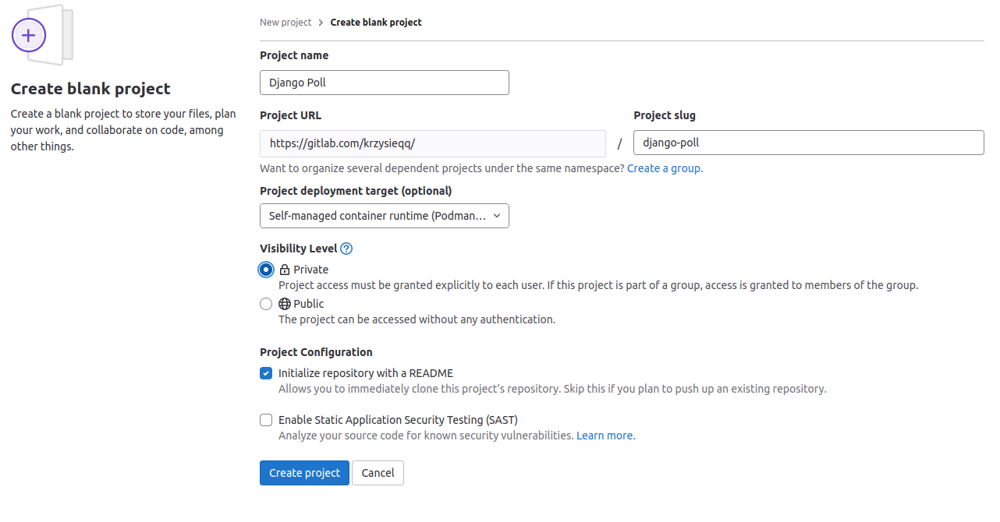
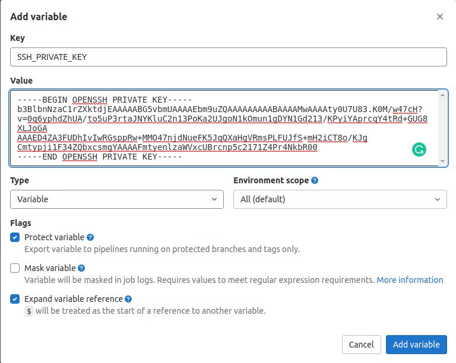
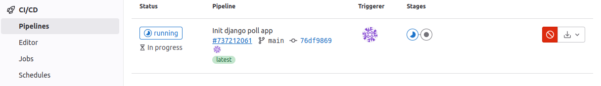
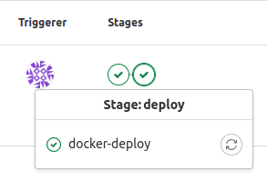
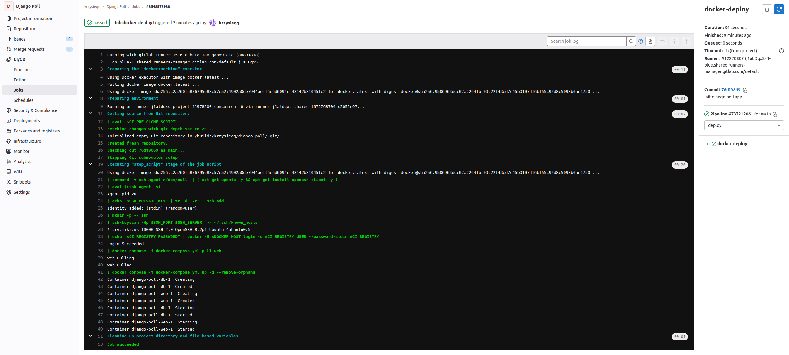
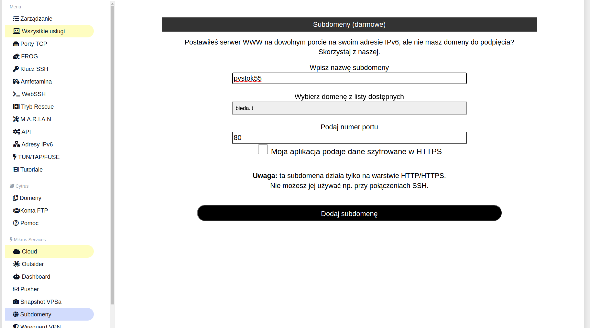
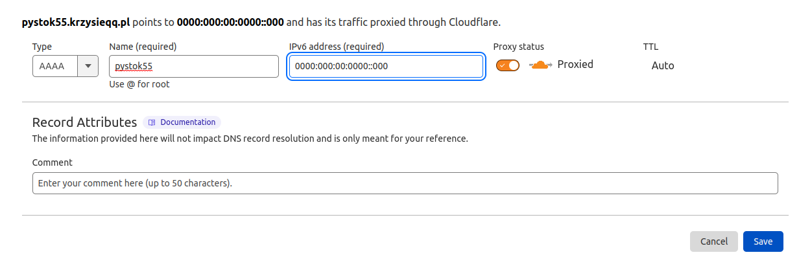

# Simple Django project with Docker, docker-compose, and CI/CD using Mikr.us  
## Intro
This repository was created for the talk at the [PyStok](https://pystok.org/pystok-55/) [#55](https://www.facebook.com/events/486108750034527) event. 
This guide will demonstrate how to use Docker, Docker-Compose, and Gitlab CI to do your small dockerized project and deploy to [mikr.us](https://mikr.us/?r=eacdde60) VPS.

If you have any problems feel free to create an issue on [GitHub](https://github.com/krzysieqq/gitlab-cicd)

You can also review the app at [GitLab](https://gitlab.com/krzysieqq/django-poll/).

If you have any questions, you can also [join my Discord](https://discord.gg/wgFKegXFZ5).

## Requirements
Before starting, make sure that you have installed the following:
- [Docker](https://docs.docker.com/desktop/) ([Linux](https://docs.docker.com/desktop/install/linux-install/), [Mac](https://docs.docker.com/desktop/install/mac-install/), [Windows](https://docs.docker.com/desktop/install/windows-install/))
- [Docker Compose v2](https://docs.docker.com/compose/install/) - You need this only if you have installed Docker Engine or Docker CLI. Docker Desktop includes Docker Compose.

## Creating a project from scratch
#### For a better understanding, I encourage you to read the following:
 - [Docker tutorial](https://docs.docker.com/get-started/)
 - [Docker Compose tutorial](https://docs.docker.com/compose/gettingstarted/)
   - [Explore the full list of Compose commands](https://docs.docker.com/compose/reference/)
   - [Explore the Compose configuration file reference](https://docs.docker.com/compose/compose-file/)
 - [Django tutorial](https://docs.djangoproject.com/en/3.2/intro/tutorial01/)

### Let's start with our project!

1. Create an empty project directory.
    
    ```console
    mkdir django-poll
    ```

    You can name the directory on something easy for you to remember. This directory is the context for your application image. The directory should only contain resources to build that image.

2. Go to the root of your project directory.
    ```console
    cd django-poll
    ```

3. Create a new file called `Dockerfile` in your project directory.

    The Dockerfile defines an application's image content via one or more build
    commands that configure that image. Once built, you can run the image in a
    container. For more information on `Dockerfile`, see the [Docker user guide](https://docs.docker.com/get-started/)
    and the [Dockerfile reference](https://docs.docker.com/engine/reference/builder/).

4. Add the following content to the `Dockerfile`.

    ```dockerfile
    # syntax=docker/dockerfile:1
    FROM python:3
    ENV PYTHONDONTWRITEBYTECODE=1
    ENV PYTHONUNBUFFERED=1
    WORKDIR /code
    COPY requirements.txt /code/
    RUN pip install -r requirements.txt
    COPY . /code/
    ```

    This `Dockerfile` starts with a [Python parent image](https://hub.docker.com/r/library/python).
    The parent image is modified by:
    - settings environment variables:
      - `ENV PYTHONDONTWRITEBYTECODE=1` - [This prevents Python from writing out pyc files](https://docs.python.org/3/using/cmdline.html#envvar-PYTHONDONTWRITEBYTECODE)
      - `ENV PYTHONUNBUFFERED=1` - [This keeps Python from buffering stdin/stdout](https://docs.python.org/3/using/cmdline.html#envvar-PYTHONUNBUFFERED)
      - `WORKDIR /code` - adding a new `code` directory
      - `COPY requirements.txt /code/` - coping `requirements.txt` file from [context](https://docs.docker.com/build/building/context/#path-context) to the `code` folder inside the docker image
      - `RUN pip install -r requirements.txt` - installing the Python requirements defined in the `requirements.txt` file

5. Create a `requirements.txt` in your project directory.

    This file is used by the `RUN pip install -r requirements.txt` command in your `Dockerfile`.

6. Add the required software to the file.

    ```python
    # Install the last Django LTS
    Django>=3.2,<3.3
    # Install PostgreSQL database adapter
    psycopg2>=2.9
    ```
   
7. Create a file called `docker-compose.yml` in your project directory.

    The `docker-compose.yml` file describes the services that make your app. In
    this example, those services are a web server and a database. The compose file
    also describes which Docker images these services use, how they link
    together, and any volumes they might need to be mounted inside the containers.
    Finally, the `docker-compose.yml` file describes which ports these services
    expose. See the [`docker-compose.yml` reference](https://docs.docker.com/compose/compose-file/) for more
    information on how this file works.

8. Add the following configuration to the file.

    ```yaml
    services:
      db:
        image: postgres
        restart: unless-stopped
        volumes:
        - postgresql_data:/var/lib/postgresql/data
        environment:
        - POSTGRES_PASSWORD=${POSTGRES_PASSWORD:-postgres}
      web:
        build: .
        restart: unless-stopped
        command: python manage.py runserver 0.0.0.0:8000
        volumes:
        - .:/code
        ports:
        - "8000:8000"
        environment:
        - POSTGRES_PASSWORD=${POSTGRES_PASSWORD:-postgres}
        depends_on:
        - db
    
    volumes:
      postgresql_data:
    ```

    This file defines two services: The `db` service and the `web` service.
    - `db` service will mount `postgresql_data` [volume](https://docs.docker.com/storage/volumes/) to 
    `/var/lib/postgresql/data` inside Docker. Thanks to this, data from the container won't be lost. We also set the new
    environment variable: `POSTGRES_PASSWORD` with a password to the Postgres database. `${POSTGRES_PASSWORD:-postgres}` means
    take environment variable `POSTGRES_PASSWORD` or if it doesn't exist, set the default value to `postgres`.
    - `web` service defines a few more things. 
      - We set the current directory as context (`build: .`). It will be used when we build a container using `docker compose build`
      - `restart: unless-stopped` restart the container unless stopped e.g. using `docker compose stop`
      - Entrypoint command that will be used to run the container is `python manage.py runserver 0.0.0.0:8000`.
      - We mount the current directory (the directory where is `docker-compose.yml` file) inside the`/code` folder 
      in the container.
      ```yaml
      volumes:
      - .:/code
      ```
      - Next, we publish `8000` port outside the container. Below code map TCP port 8000 in the container to port 8000 on the Docker host (`<host>:<container>`).
      ```yaml
      ports:
      - "8000:8000"
      ```
      - We add a new environment variable, `POSTGRES_PASSWORD`, with the default value "postgres".
      - Our container depends on `db`, so the container with the database should start first, and then `web` container 
      will start. 
      ```yaml
      depends_on:
      - db
      ```


### Create a Django project

In this step, you create a Django starter project by building the image from the build context defined in the previous procedure.

1. Create in your project directory the Django project by running the [docker compose run](https://docs.docker.com/engine/reference/commandline/compose_run/)
   command as follows. The project name should follow [PEP-8](https://peps.python.org/pep-0008/#package-and-module-names) naming convention.

   ```console
   docker compose run web django-admin startproject django_poll .
   ```

   This instructs Compose to run `django-admin startproject <project_name>`
   in a container, using the `web` service's image and configuration. Because
   the `web` image doesn't exist yet, Compose builds it from the current
   directory, as specified by the `build: .` line in `docker-compose.yml`.

   Once the `web` service image is built, Compose runs it and executes the
   `django-admin startproject` command in the container. This command
   instructs Django to create a set of files and directories representing a
   Django project.

2. After the `docker compose` command completes, list the contents of your project.

   ```console
   $ ls -l

    drwxr-xr-x 2 root    root    django_poll
    -rw-rw-r-- 1 user    user    docker-compose.yml
    -rw-rw-r-- 1 user    user    Dockerfile
    -rwxr-xr-x 1 root    root    manage.py
    -rw-rw-r-- 1 user    user    requirements.txt

   ```

   If you are running Docker on Linux, the files `django-admin` created are
   owned by root. This happens because the container runs as the root user.
   Change the ownership of the new files.

   ```console
   sudo chown -R $USER:$USER django_poll manage.py
   ```

   If you are running Docker on Mac or Windows, you should already
   have ownership of all files, including those generated by
   `django-admin`. List the files to verify this.

### Connect the database and start the project

In this section, you set up the database connection for Django and start `docker compose` with a project.

1. In your project directory, edit the `django_poll/settings.py` file.

2. Add to the beginning of the file
    ```python
    import os
    ```
3. Replace the `DATABASES = ...` with the following:

    ```python
    DATABASES = {
       'default': {
           'ENGINE': 'django.db.backends.postgresql',
           'NAME': 'postgres',
           'USER': 'postgres',
           'PASSWORD': os.getenv('POSTGRES_PASSWORD'),
           'HOST': 'db',
           'PORT': 5432,
       }
    }
    ```

    These settings are required because we decided to use [postgres](https://hub.docker.com/_/postgres)
    as database. We specified it in `docker-compose.yml`.

4. Run the [docker compose up](https://docs.docker.com/engine/reference/commandline/compose_up/) command from the top level directory for your project.

   ```console
   $ docker compose up
   
   [+] Running 2/0
    ⠿ Container django-poll-db-1   Running                                                                                                                                                                                                                                                                             0.0s
    ⠿ Container django-poll-web-1  Created                                                                                                                                                                                                                                                                             0.1s
   Attaching to django-poll-db-1, django-poll-web-1
    ⠿ Container django-poll-db-1            Created                                                                                                                                                                                                                                                                    0.1s
    ⠿ Container django-poll-web-1           Created                                                                                                                                                                                                                                                                    0.1s
   Attaching to django-poll-db-1, django-poll-web-1
   django-poll-db-1   | The files belonging to this database system will be owned by user "postgres".
   django-poll-db-1   | This user must also own the server process.
   < ... >
   django-poll-web-1  | Watching for file changes with StatReloader
   django-poll-web-1  | Performing system checks...
   django-poll-web-1  | 
   django-poll-web-1  | System check identified no issues (0 silenced).
   django-poll-web-1  | December 11, 2022 - 17:15:11
   django-poll-web-1  | Django version 3.2.16, using settings 'django_poll.settings'
   django-poll-web-1  | Starting development server at http://0.0.0.0:8000/
   django-poll-web-1  | Quit the server with CONTROL-C.
   
   ```

   At this point, your Django app should be running at port `8000` on
   your Docker host. On Docker Desktop for Mac and Docker Desktop for Windows, go
   to `http://localhost:8000` on a web browser to see the Django
   welcome page.
   

   > Note:
   >
   > On specific platforms (Windows 10), you might need to edit `ALLOWED_HOSTS`
   > inside `settings.py` and add your Docker hostname or IP address to the list.
   > For demo purposes, you can set the value to:
   >
   > ```python
   > ALLOWED_HOSTS = ['*']
   > ```
   >
   > This value is **not** safe for production usage.  Refer to the
   > [Django documentation](https://docs.djangoproject.com/en/1.11/ref/settings/#allowed-hosts)  for more information.

5. List running containers.

   In another terminal window, list the running Docker processes with the `docker ps` or `docker container ls` command.

   ```console
   $ docker ps

   CONTAINER ID   IMAGE             COMMAND                  CREATED         STATUS         PORTS                                       NAMES
   42a04442ac98   django-poll-web   "python manage.py ru…"   3 minutes ago   Up 3 minutes   0.0.0.0:8000->8000/tcp, :::8000->8000/tcp   django-poll-web-1
   2068de7d75d8   postgres          "docker-entrypoint.s…"   3 minutes ago   Up 3 minutes   5432/tcp                                    django-poll-db-1
   ```

6. Shut down services and clean up by using either of these methods:

    * Stop the application by typing `Ctrl-C`  in the same shell in where you
      started it:

      ```console
      Gracefully stopping... (press Ctrl+C again to force)
      Killing django-poll-web-1 ... done
      Killing django-poll-db-1 ... done
      ```

    * Or, for a more elegant shutdown, switch to a different shell, and run
      [docker compose down](https://docs.docker.com/engine/reference/commandline/compose_down/) from the top level of your
      Django sample project directory.

      ```console
      $ docker compose down

      Stopping django-poll-web-1 ... done
      Stopping django-poll-db-1 ... done
      Removing django-poll-web-1 ... done
      Removing django-poll-web_run_1 ... done
      Removing django-poll-db-1 ... done
      Removing network django-poll_default
      ```

### Setup project for local development

In this section, you prepare a project for easy local development.

1. Create a file called `docker-compose.override.yml` in your project directory and add the following configuration.
    More about multiple Compose files can be read [here](https://docs.docker.com/compose/extends/#multiple-compose-files)
2. Add the following configuration to the file.
    ```yaml
    services:
      web:
        command: python manage.py runserver 0.0.0.0:8000
        volumes:
          - .:/code
        ports:
          - "8000:8000"
    ```
    This file overrides the `web` service by adding the custom command `runserver` and mounting
    the current directory to `/code` location inside a container. Thanks to this operation, you will
    be able to work with the code inside the container that will be reloaded automatically. We also
    map `8000` port from container to host.
3. Edit a `requirements.txt` in your project directory and add the following packages.
   ```python
    # Install Python WSGI HTTP Server for UNIX
    gunicorn>=20.1
    # Install simplified static file serving for Python web apps
    whitenoise>=6.2
    ```
4. Edit a `web` section in `docker-compose.yml`. It should look like below:
    ```yaml
     web:
       image: ${CI_REGISTRY_IMAGE:-local/django_poll}:${CI_COMMIT_REF_SLUG:-local}
       build: .
       environment:
       - POSTGRES_PASSWORD=${POSTGRES_PASSWORD:-postgres}
       depends_on:
       - db
    ```
    We have added an image name with default values which helps us when we call it in CI/CD.
    We use there [Gitlab Ci Variables](https://docs.gitlab.com/ee/ci/variables/) which are available in pipelines.
    Sections that were transferred to the `docker-compose.override.yml` file have been deleted. 
5. Edit the `settings.py` file in your application:
    - Add to `MIDDLEWARE` list `'whitenoise.middleware.WhiteNoiseMiddleware',` at the end. 
    - Add `STATIC_ROOT = '/static/'` as config of root folder contains static files.
6. Edit `urls.py` file in your application by adding
    - at the beginning: 
    ```python
      from django.conf import settings
      from django.conf.urls.static import static
    ```
    - at the bottom: `urlpatterns += static(settings.MEDIA_URL, document_root=settings.MEDIA_ROOT)`
7. Now, you are ready to rebuild the project. This is needed for new dependencies declared in 
    the `requirements.txt` file to be installed. Just run
    ```console
    $ docker compose build
    [+] Building 1.6s (14/14) FINISHED                                                                                                                                                                                                                                                                                             
    => [internal] load build definition from Dockerfile                                                                                                                                                                                                                                                                      0.0s
    => => transferring dockerfile: 32B                                                                                                                                                                                                                                                                                       0.0s
    => [internal] load .dockerignore                                                                                                                                                                                                                                                                                         0.0s
    => => transferring context: 2B                                                                                                                                                                                                                                                                                           0.0s
    => resolve image config for docker.io/docker/dockerfile:1                                                                                                                                                                                                                                                                1.0s
    => CACHED docker-image://docker.io/docker/dockerfile:1@sha256:9ba7531bd80fb0a858632727cf7a112fbfd19b17e94c4e84ced81e24ef1a0dbc                                                                                                                                                                                           0.0s
    => [internal] load build definition from Dockerfile                                                                                                                                                                                                                                                                      0.0s
    => [internal] load .dockerignore                                                                                                                                                                                                                                                                                         0.0s
    => [internal] load metadata for docker.io/library/python:3                                                                                                                                                                                                                                                               0.0s
    => [1/5] FROM docker.io/library/python:3                                                                                                                                                                                                                                                                                 0.0s
    => [internal] load build context                                                                                                                                                                                                                                                                                         0.0s
    => => transferring context: 7.11kB                                                                                                                                                                                                                                                                                       0.0s
    => CACHED [2/5] WORKDIR /code                                                                                                                                                                                                                                                                                            0.0s
    => CACHED [3/5] COPY requirements.txt /code/                                                                                                                                                                                                                                                                             0.0s
    => CACHED [4/5] RUN pip install -r requirements.txt                                                                                                                                                                                                                                                                      0.0s
    => [5/5] COPY . /code/                                                                                                                                                                                                                                                                                                   0.0s
    => exporting to image                                                                                                                                                                                                                                                                                                    0.1s
    => => exporting layers                                                                                                                                                                                                                                                                                                   0.0s
    => => writing image sha256:770f3446a8da8cd89b454e5f6ea66368ec6fbcb16ab8b2b916f10b96389122e3                                                                                                                                                                                                                              0.0s
    => => naming to docker.io/local/django_poll:local
    ```
8. Now, you can run the project once more. Just run the [Docker compose up](https://docs.docker.com/engine/reference/commandline/compose_up/) command from the top-level directory for your project.

    ```console
    $ docker compose up
    [+] Running 2/2
    ⠿ Container django-poll-db-1   Created                                                                                                                                                                                                                                                                                   0.0s
    ⠿ Container django-poll-web-1  Recreated                                                                                                                                                                                                                                                                                 0.1s
    Attaching to django-poll-db-1, django-poll-web-1
    django-poll-db-1   | 
    django-poll-db-1   | PostgreSQL Database directory appears to contain a database; Skipping initialization
    django-poll-db-1   | 
    django-poll-db-1   | 2022-12-18 23:14:28.416 UTC [1] LOG:  starting PostgreSQL 15.1 (Debian 15.1-1.pgdg110+1) on x86_64-pc-linux-gnu, compiled by gcc (Debian 10.2.1-6) 10.2.1 20210110, 64-bit
    django-poll-db-1   | 2022-12-18 23:14:28.416 UTC [1] LOG:  listening on IPv4 address "0.0.0.0", port 5432
    django-poll-db-1   | 2022-12-18 23:14:28.416 UTC [1] LOG:  listening on IPv6 address "::", port 5432
    django-poll-db-1   | 2022-12-18 23:14:28.421 UTC [1] LOG:  listening on Unix socket "/var/run/postgresql/.s.PGSQL.5432"
    django-poll-db-1   | 2022-12-18 23:14:28.428 UTC [29] LOG:  database system was shut down at 2022-12-18 23:10:04 UTC
    django-poll-db-1   | 2022-12-18 23:14:28.435 UTC [1] LOG:  database system is ready to accept connections
    django-poll-web-1  | Watching for file changes with StatReloader
    django-poll-web-1  | Performing system checks...
    django-poll-web-1  | 
    django-poll-web-1  | System check identified no issues (0 silenced).
    django-poll-web-1  | December 18, 2022 - 23:14:30
    django-poll-web-1  | Django version 3.2.16, using settings 'django_poll.settings'
    django-poll-web-1  | Starting development server at http://0.0.0.0:8000/
    django-poll-web-1  | Quit the server with CONTROL-C.
    ```

### Develop local project

Now you should develop your project. For example, you can write your [first Django app 
with an official Django tutorial](https://docs.djangoproject.com/en/3.2/intro/tutorial01/).
Remember that all commands are given inside the tutorial you should run inside your container.\
If the tutorial says that you should run the command:
```
$ python manage.py startapp polls
```
You need to [go first inside your container](https://docs.docker.com/engine/reference/commandline/compose_exec/) and then run this command.
```
$ cd django-poll/                                                                                                                                                                                                                                                             
user@local-pc:~/Workspace/django-cicd/django-poll$ docker compose exec web bash
root@ae372cbade9b:/code# python manage.py startapp polls
root@ae372cbade9b:/code# 
```
We run this command from the place where we create `docker-compose.yml`

---
Remember that all files created inside a container on your local file system will have `root` 
permissions. This happens because the container runs as the root user. You can change 
the ownership of the new files using the command below. It will change ownership of all files 
inside the current directory.
---
```console
$ sudo chown -R $USER:$USER .
```

#### Create a home page
Our app should have a simple home page to see if everything works fine.
1. Go to `settings.py`, search for `TEMPLATES = [...` and add to `['DIRS']` folder with templates: `['templates'],`
    so it should look like this:
    ```
    TEMPLATES = [
        {
            'BACKEND': 'django.template.backends.django.DjangoTemplates',
            'DIRS': ['templates'],
            'APP_DIRS': True,
            'OPTIONS': {
                'context_processors': [
                    'django.template.context_processors.debug',
                    'django.template.context_processors.request',
                    'django.contrib.auth.context_processors.auth',
                    'django.contrib.messages.context_processors.messages',
                ],
            },
        },
    ]
    ```
2. At the root of your project create folder `templates`
3. Inside the folder `templates` create a `home.html` file and paste it into your simple HTML site. 
    In my case content of this file looks as follows:
    ```html
    <!doctype html>
    <html class="no-js" lang="en">
    
    <head>
      <meta charset="utf-8">
      <title>PyStok 55 - Alfabet dewelopera - (A)utomatyczne (B)udowanie (C)iągłe (D)ostarczanie</title>
      <meta name="description" content="">
      <meta name="viewport" content="width=device-width, initial-scale=1">
    </head>
    
    <body>
      <h1>Alfabet dewelopera - (A)utomatyczne (B)udowanie (C)iągłe (D)ostarczanie</h1>
      <p>Hello world!</p>
      <p>Krzysztof Owsieniuk</p>
    </body>
    </html>
    ```
4. Open `urls.py` and add before urlpatterns import:
    ```python
    from django.views.generic import TemplateView
    ```
    And next, add to `urlpatterns` path to your homepage so it should look like this:
    ```python
    urlpatterns = [
        path('', TemplateView.as_view(template_name='home.html')),
        path('admin/', admin.site.urls),
    ] + static(settings.MEDIA_URL, document_root=settings.MEDIA_ROOT)

    ```


### Prepare your server

If your project is ready to deploy, you must prepare your VPS (Virtual Private Server).
In our case, we will use [MIKR.US](https://mikr.us/?r=eacdde60). We want to run Docker inside, so 
we must choose the *Mikrus 2.1* server or above. After purchasing the service, you will 
receive auth data to the server on your email address.

1. Login into your VPS through ssh.
    ```
    $ ssh root@<your_server>.mikr.us -p 10000
    ```
2. We need to install Docker inside. For this purpose, we will use [NOOBS scripts](https://github.com/unkn0w/noobs)
    preinstalled on the machine. In our case, we will use [*chce_dockera.sh*](https://github.com/unkn0w/noobs/blob/main/scripts/chce_dockera.sh) script, 
    which will install `Docker`
    ```
    $ . /opt/noobs/scripts/chce_dockera.sh
   
    [...]
   
    Unable to find image 'hello-world:latest' locally
    latest: Pulling from library/hello-world
    2db29710123e: Pull complete 
    Digest: sha256:c77be1d3a47d0caf71a82dd893ee61ce01f32fc758031a6ec4cf1389248bb833
    Status: Downloaded newer image for hello-world:latest
    
    Hello from Docker!
    This message shows that your installation appears to be working correctly.
    
    To generate this message, Docker took the following steps:
     1. The Docker client contacted the Docker daemon.
     2. The Docker daemon pulled the "hello-world" image from the Docker Hub.
        (amd64)
     3. The Docker daemon created a new container from that image which runs the
        executable that produces the output you are currently reading.
     4. The Docker daemon streamed that output to the Docker client, which sent it
        to your terminal.
    
    To try something more ambitious, you can run an Ubuntu container with:
     $ docker run -it ubuntu bash
    
    Share images, automate workflows, and more with a free Docker ID:
     https://hub.docker.com/
    
    For more examples and ideas, visit:
     https://docs.docker.com/get-started/
    ```

3. Of course, this is a minimal setup, and it is not recommended to use it in the production
    server. 

### Prepare Gitlab and project for deploy
After our server has a minimal setup, we need to create our GitLab project and create some 
more local setups. If this is your first time with Gitlab CI, please familiarize yourself with [Gitlab CI Quick Start](https://docs.gitlab.com/ee/ci/quick_start/).
This section will use [GitLab CI/CD Examples](https://docs.gitlab.com/ee/ci/examples/) and 
[SSH keys with GitLab CI/CD](https://docs.gitlab.com/ee/ci/ssh_keys/) adapted to our needs.

1. [Create a new SSH key pair locally](https://docs.gitlab.com/ee/user/ssh.html#generate-an-ssh-key-pair) with [ssh-keygen](https://linux.die.net/man/1/ssh-keygen).
    Run `ssh-keygen -t` followed by the key type and an optional comment. This comment is included in the .pub file that’s created. 
    You can use an email address for the comment. For example, for ED25519:
    ```bash
    $ ssh-keygen -t ed25519 -C "<comment>"
    ```
    For 2048-bit RSA:
    ```bash
    $ ssh-keygen -t rsa -b 2048 -C "<comment>"
    ```
    Remember that your generated private key should be stored by default in `~/.ssh/` folder.
2. Create a new [Gitlab project](https://gitlab.com/projects/new#blank_project)

3. Add the private key as a [GitLab CI variable](https://docs.gitlab.com/ee/ci/variables/index.html) to your project. 
    You can do it from `Settings->CI/CD->Variables`. A variable should have the name `SSH_PRIVATE_KEY`
    and store your private key generated in 1 step.

4. You need to add two more variables as above.
    - `SSH_SERVER` should store your server address 
    - `SSH_PORT` should store your server port
5. Minimal Gitlab setup is complete. Now we need to prepare our project. First, we should set up our repository with a local project. Because we have an existing project, if we try to clone git inside a folder
    with files, it could throw an error: `fatal: destination path '.' already exists and is not an empty directory.`.
    So we need to do it differently way e.g.
    `git clone git@gitlab.com:<you gitlab repo>.git temp && mv temp/.git . && rm -rf temp`
    or use one of [other solutions](https://stackoverflow.com/questions/2411031/how-do-i-clone-into-a-non-empty-directory) like init repo and add origin.

6. Create a `.gitlab-ci.yml` file at the repository's root. This file is where you define the CI/CD jobs. Add the following content to the file.
    ```yaml
    # Use the official docker image in all stages
    image: docker:latest
    
    # We define two stages
    stages:
      - build
      - deploy
    
    # The first stage will be responsible for building our project using `docker compose` command
    # and push built images to the GitLab repository
    docker-build:
      stage: build
      services:
        - docker:dind
      before_script:
        - echo "$CI_REGISTRY_PASSWORD" | docker login $CI_REGISTRY -u $CI_REGISTRY_USER --password-stdin
      script:
        - docker compose -f docker-compose.yml build
        - docker compose push
    
    # Second stage will deploy our app to the server using a remote docker host connection.
    docker-deploy:
      stage:
        deploy
      variables:
        # Setup temporary stage variable
        DOCKER_HOST: ssh://root@$SSH_SERVER:$SSH_PORT
      before_script:
        # Install ssh-agent if not already installed. Docker requires it.
        - 'command -v ssh-agent >/dev/null || ( apt-get update -y && apt-get install openssh-client -y )'
    
        # Run ssh-agent (inside the built environment)
        - eval $(ssh-agent -s)
    
        # Add the SSH key stored in SSH_PRIVATE_KEY variable to the agent store
        # We're using tr to fix line endings which makes ed25519 keys work
        # without extra base64 encoding.
        # https://gitlab.com/gitlab-examples/ssh-private-key/issues/1#note_48526556
        - echo "$SSH_PRIVATE_KEY" | tr -d '\r' | ssh-add -
    
        # Create a `.ssh` folder if it does not exist
        - mkdir -p ~/.ssh
    
        # Use ssh-keyscan to scan the keys of your private server.
        - ssh-keyscan -Hp $SSH_PORT $SSH_SERVER  >> ~/.ssh/known_hosts
        # Login on a remote server to the GitLab repository
        - echo "$CI_REGISTRY_PASSWORD" | docker -H $DOCKER_HOST login -u $CI_REGISTRY_USER --password-stdin $CI_REGISTRY
      script:
        # We pull our image built-in `docker-build` stage. The image is downloaded one at a time due to the:
        # https://github.com/docker/compose/issues/9448
        - docker compose -f docker-compose.yml pull web
        - docker compose -f docker-compose.yml up -d --remove-orphans
    ```
7. Add `wait-for-it.sh` file to the project root. You can download the content of this file from [here](https://github.com/vishnubob/wait-for-it).
    This file is a bash script that will wait on the availability of a host and TCP port. You can also use the command above to download the file.

    ```bash
    $ wget https://raw.githubusercontent.com/vishnubob/wait-for-it/master/wait-for-it.sh
    ```
    Remember to add execution right for this script using `$ chmod +x wait-for-it.sh`

8. Edit your `docker-compose.yml` file, and after `build: .` section add the following content:

    ```yaml
    command: bash -c "
      ./wait-for-it.sh db:5432 &&
      python manage.py migrate --noinput &&
      python manage.py collectstatic --noinput &&
      gunicorn django_poll.wsgi --workers 2 --bind 0.0.0.0:8000
      "
    ports:
    - "80:8000"
    ```
    This will add a custom entrypoint command running at your server's container startup. The first thing this script does 
    is wait for the database until she is ready to accept connections. Then we will migrate our
    migrations, collect static files, which will be served by `whitenoise`, and run the gunicorn WSGI server with our app at the `8000` port inside the container. We map this port 
    to the `80` port at our server because we will accept connection at this port from the internet. This is the default port for the HTTP protocol.

9. Edit `settings.py`, turn off debug mode setting `DEBUG = False` and add your domain name to `ALLOWED_HOSTS` list,
    or you can set it to ALLOWED_HOSTS = ['*'] for development purposes.

10. Last but not least is to create `.dockerignore` at the root of your project.
    This file tells Docker when he is building a container which files should ignore and don't add inside the image.
    We should add to this file all files which we won't be able at our server and could potentially be dangerous.
    In my case, this file contains the following content.

    ```
    *.py[cod]
    *.mo
    *.db
    *.egg-info
    *.sql*
    .cache
    .project
    .idea
    .pydevproject
    .idea/
    .DS_Store
    .git/
    .sass-cache
    __pycache__
    dist
    docs
    env
    logs
    Dockerfile
    docker-compose*
    ```

11. Commit all your changes and push them to a remote server.

    ```bash
    $ git add . && git commit -m "Init django poll app" && git push
    ```
    After you push your changes at the Gitlab inside the `CI/CD->Pipelines` section, you should see you running jobs.\
    

    You can track changes that were done at the pipeline by clicking a single job name and going inside.\
    

    You should see a screen like the one below. It describes all things which the GitLab runner server has done.\
    

12. If everything works fine, after login into your server through the ssh you and using `curl` on `localhost` you should see the same content as your created.  
    ```bash
    root@i359:~# curl localhost
    <!doctype html>
    <html class="no-js" lang="en">
    
    <head>
      <meta charset="utf-8">
      <title>PyStok 55 - Alfabet dewelopera - (A)utomatyczne (B)udowanie (C)iągłe (D)ostarczanie</title>
      <meta name="description" content="">
      <meta name="viewport" content="width=device-width, initial-scale=1">
    </head>
    
    <body>
      <h1>Alfabet dewelopera - (A)utomatyczne (B)udowanie (C)iągłe (D)ostarczanie</h1>
      <p>Hello world!</p>
      <p>Krzysztof Owsieniuk</p>
    </body>
    ```
### Configure your domain
If everything went okay in the previous steps, the last stage is to set up your domain. There are two most common 
cases we may encounter. The first is when you don't have your domain, and the second is when you have one. 

#### I don't have a domain
If you don't have your own domain, you can configure [free subdomain provided by Mikr.us](https://www.notion.so/Darmowa-subdomena-dla-VPS-6e73137349144646a18cbb51319f09a9). For this, you 
need to go to the [management panel](https://mikr.us/panel/) and go to the tab `Subdomeny`. Next,
name your subdomain and save the changes.



Setup can take about 5 minutes. After this time, go to [your subdomain](https://pystok55.bieda.it/) and check if everything works fine!

#### I have my own domain
There are a few different ways to connect your domain with Mikr.us. We will use [the most recommended](https://www.notion.so/Podpi-cie-domeny-przez-CloudFlare-2a04b845203a4d9b82fa1816c6962d8e) i.e. 
we will use free [Cloudflare](https://www.cloudflare.com/) for this purpose. So if you don't have 
a Cloudflare account, create it. Next, login, go to `Websites`, and click `+ Add site`.
Next, enter your site at the input and click `Add Site`. The next step is to choose a subscription plan. We will
use the free plan, so select the free option at the bottom and continue. Now you have to change your domain DNS to given by
Cloudflare. Pointing to Cloudflare’s nameservers is a critical step in activation and must be completed 
for Cloudflare to optimize and protect your site. Log in to your domain provider, go to DNS settings, and set the server
to provided by Cloudflare. Save your changes. Registrars can take 24 hours to process nameserver updates. 
You will receive an email when your site is active on Cloudflare. After your domain setup is complete, go to Cloudflare to
your domain, next `DNS->Records` and add a new record with the `AAAA` type name you choose and your Mikr.us IPv6 address, `Proxy 
status` must be checked.
You can check your IPv6 Mikrus address by login through ssh and using the command:
```bash
ip -6 addr
```
or if you don't want to search, you [can use this](https://superuser.com/a/1057290):
```bash
/sbin/ip -6 addr | grep inet6 | awk -F '[ \t]+|/' '{print $3}' | grep -v ^::1 | grep -v ^fe80
```


After saving if everything was fine, go to [your subdomain](pystok55.krzysieqq.pl) and enjoy the completed process!


## Credits and more documentation:
* [Docker overview](https://docs.docker.com/get-started/)
* [Docker Compose overview](https://docs.docker.com/compose/)
* [Awesome Compose Django sample application](https://github.com/docker/awesome-compose/tree/master/official-documentation-samples/django/)
* [Docker overview](https://docs.djangoproject.com/en/3.2/intro/overview/)
